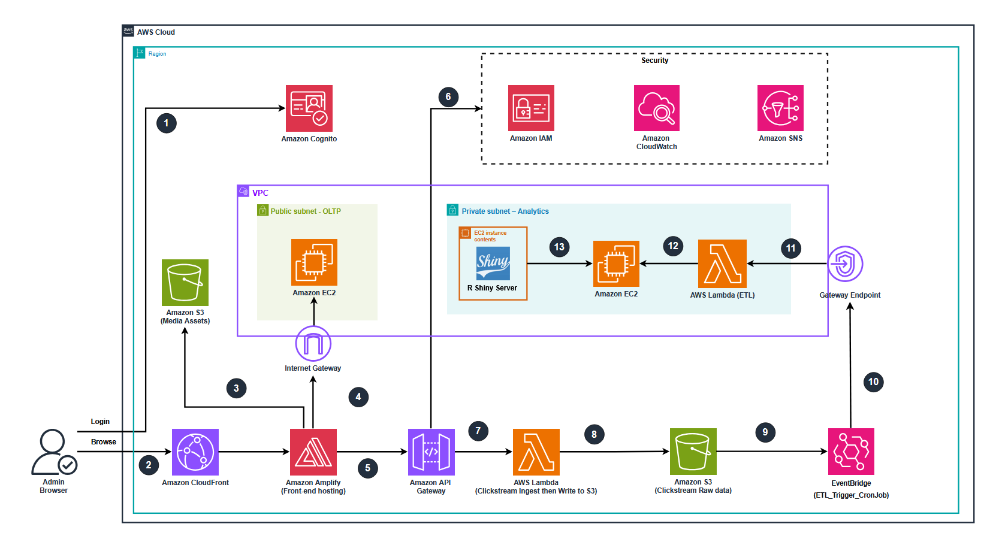

# 📊 SBW Clickstream Analytics Platform for E-Commerce
---
## 0. Technical Architecture Diagram

---
## 1. Project Overview
This project implements a **Batch-Based Clickstream Analytics Platform** for an e-commerce website selling computer products.
The system:
- Collects clickstream events from the frontend (Next.js on Amplify)
- Stores raw JSON data in **Amazon S3 (Raw Clickstream Bucket)**
- Processes events via scheduled ETL (**AWS Lambda ETL + EventBridge cron**)
- Loads analytical data into a dedicated **PostgreSQL Data Warehouse** on EC2 (private subnet)
- Exposes analytics dashboards via **R Shiny Server** running next to the DW

### 1.1. Design Principles
- Clear separation between **OLTP vs Analytics** workloads
- Private-only analytical backend (**DW + Shiny + ETL in private subnets**)
- Cost-efficient AWS serverless components (**no NAT Gateway**, S3 + Lambda)
- Minimal moving parts for reliability and simplicity
---

## 2. High-Level Architecture Summary

### 2.1. User-Facing Domain
#### Frontend
- Framework: **Next.js**
- Hosting: **AWS Amplify Hosting**
- Under the hood, Amplify uses:
  - **Amazon CloudFront** (global CDN)
  - **Amazon S3** (static assets bucket)
- Authentication:
  - **Amazon Cognito User Pool**

#### Operational Database (OLTP)
- A standalone **EC2** instance running **PostgreSQL**
- Stores:
  - Users
  - Products
  - Orders
  - OrderItems
  - Inventory & transactional data
- Located in the **Public Subnet** so Amplify’s SSR / API routes can connect via **Prisma** using `DATABASE_URL`

> In a stricter production setup OLTP would be private (e.g. RDS), but here OLTP EC2 is public by design to simplify connectivity from Amplify (which runs outside the VPC).

---

### 2.2. Ingestion & Data Lake Domain

#### Ingestion Flow
1. Frontend records user behavior (page views, clicks, interactions).
2. Events are POSTed as JSON to **Amazon API Gateway (HTTP API)**:
   ```http
   POST /clickstream
   ```
3. API Gateway invokes a **Lambda Ingest Function**.
4. Lambda Ingest:
   * Validates / parses the payload
   * Enriches metadata (timestamps, user/session IDs, HTTP context, etc.)
   * Writes raw JSON into the **S3 Raw Clickstream Bucket**:
   ```text
   s3://<raw-clickstream-bucket>/events/YYYY/MM/DD/HH/event-<uuid>.json
   ```

#### Batch ETL Flow
* **Amazon EventBridge** defines a cron rule (e.g. every 30 minutes).
* On each schedule:
  * EventBridge triggers **Lambda ETL** (configured inside the VPC).
  * Lambda ETL:
    * Reads new raw files from **S3 Raw Bucket**
    * Cleans, normalizes, and sessionizes events
    * Converts NoSQL-style JSON into **SQL-ready analytic tables**
    * Inserts processed data into the **PostgreSQL Data Warehouse** hosted on EC2 in a private subnet

> No separate “processed” S3 bucket: ETL writes directly into analytic SQL tables.

---

### 2.3. Analytics & Data Warehouse Domain
The analytics environment runs on **two EC2 instances**, each with a dedicated role.

#### EC2 #1 — OLTP Database (Public Subnet)
* PostgreSQL database for the e-commerce application.
* Serves live operational traffic:
  * Product listing
  * Cart / checkout
  * Orders, inventory, users
* Accessible over the internet only to:
  * Amplify SSR / backend
  * Admin / maintenance IPs (via Security Groups)

#### EC2 #2 — Data Warehouse + R Shiny (Private Subnet)

##### PostgreSQL Data Warehouse
* Stores curated clickstream analytics schema, e.g.:
  * `event_id`
  * `event_timestamp`
  * `event_name`
  * `user_id`
  * `user_login_state`
  * `identity_source`
  * `client_id`
  * `session_id`
  * `is_first_visit`
  * `product_id`
  * `product_name`
  * `product_category`
  * `product_brand`
  * `product_price`
  * `product_discount_price`
  * `product_url_path`
  * Aggregated metrics tables
* Located in a **Private Subnet** (no public IP).
* Receives data exclusively from **Lambda ETL** within the VPC.

##### R Shiny Analytics Server
* Runs on the same EC2 instance as the DW.
* Connects locally to the DW database.
* Hosts interactive dashboards visualizing:
  * User journeys
  * Conversion funnels
  * Product engagement
  * Time-based trends

> OLTP and Analytics are fully separated so reporting queries cannot impact transactional performance.

---

## 3. Networking & Security Design

### 3.1. VPC Layout
* **VPC CIDR**: `10.0.0.0/16`
* **Internet Gateway (IGW)**:
  * Attached to the VPC
  * Provides bidirectional connectivity for public resources

#### Subnets
* **Public Subnet (10.0.1.0/24) — OLTP Layer**
  * EC2 PostgreSQL OLTP (with public IP)
  * Routes internet traffic via **Internet Gateway**
  * Allows inbound connections from:
    * Amplify
    * Admin IPs
  * Allows outbound internet access for updates / external APIs
* **Private Subnet 1 (10.0.2.0/24) — Analytics Layer**
  * EC2 Data Warehouse (PostgreSQL) — no public IP
  * EC2 R Shiny Server — no public IP
  * No direct internet access (no route to IGW)
  * Isolated from public internet
* **Private Subnet 2 (10.0.3.0/24) — ETL Layer**
  * Lambda ETL (VPC-enabled) — no public IP
  * S3 Gateway VPC Endpoint
  * No direct internet access (no route to IGW)

### 3.2. Routing
* **Public Route Table** (Public Subnet)
  * `10.0.0.0/16` → Local (VPC internal)
  * `0.0.0.0/0` → Internet Gateway
* **Private Route Table 1** (Private Subnet 1 — Analytics)
  * `10.0.0.0/16` → Local
  * **No** default route to IGW
* **Private Route Table 2** (Private Subnet 2 — ETL)
  * `10.0.0.0/16` → Local
  * S3 prefix list routes → **S3 Gateway VPC Endpoint**
  * **No** default route to IGW

> **Key Design Decision**: No NAT Gateway.
> Private components (**DW, Shiny, ETL Lambda**) reach S3 only via the S3 Gateway VPC Endpoint, eliminating NAT costs and limiting internet exposure.

### 3.3. Security Groups
* **SG-OLTP**
  * Inbound:
    * `5432/tcp` — from Amplify / trusted IPs (Prisma)
    * `22/tcp` — from admin IP
  * Outbound: default (all allowed)
* **SG-DW**
  * Inbound:
    * `5432/tcp` — from Lambda ETL SG and Shiny SG
  * Outbound: default (all allowed)
* **SG-Shiny**
  * Inbound: only admin/VPN / internal admin tools
  * Outbound: allowed to DW (localhost / private IP)
* **SG-ETL-Lambda**
  * No inbound (Lambda does not receive inbound traffic)
  * Outbound: allowed to S3 endpoint + DW SG (private networking)

### 3.4. External AWS Services (Outside VPC)
These services are regional / global and live outside the VPC, but interact with VPC resources:
* **AWS Amplify Hosting**
  * Hosts Next.js frontend
  * Connects to OLTP EC2 via Internet Gateway using Prisma
  * Access controlled by EC2 Security Groups
* **Amazon CloudFront**
  * Global CDN
  * Pulls assets from Amplify’s S3 bucket
* **Amazon Cognito**
  * Manages user authentication (User Pool)
  * Accessed by frontend over HTTPS
* **Amazon API Gateway (HTTP API)**
  * Entry point for clickstream ingestion
  * Invokes **Lambda Ingest** (outside VPC)
  * Lambda Ingest writes raw JSON files to S3 (no VPC required)
* **Amazon EventBridge**
  * Triggers scheduled ETL jobs (cron)
  * Invokes **Lambda ETL** (VPC-enabled in private subnet 2)

> Only **Lambda ETL** is VPC-enabled to reach the DW.
> **Lambda Ingest stays outside the VPC** for simple, low-latency writes to S3.

---

## 4. IAM & Monitoring
* Separate IAM roles for each Lambda:
  * **Lambda Ingest Role**:
    * S3 write-only for the Raw bucket
    * CloudWatch Logs
  * **Lambda ETL Role**:
    * S3 read access (Raw bucket)
    * DB access permissions (DW)
    * VPC execution role
* **CloudWatch Logs**:
  * API Gateway access logs
  * Lambda Ingest & ETL logs
  * ETL execution metrics
* **(Optional)** VPC Flow Logs for detailed network analysis

---

## 5. S3 Buckets (2 Logical Buckets)
1. **Amplify Assets Bucket**
   * Stores static website assets (JS, CSS, images, etc.)
   * Managed by Amplify Hosting
2. **Raw Clickstream Data Bucket**
   * Stores raw JSON clickstream events from Lambda Ingest
   * Partitioned by date/hour:
     ```text
     events/YYYY/MM/DD/HH/event-<uuid>.json
     ```

> No “processed” S3 bucket — all processed data goes straight into the DW.

---

## 6. End-to-End Data Flow

### 6.1. User Interaction Flow
1. User → **CloudFront** (CDN) → **Amplify Hosting** (Next.js)
2. User authenticates via **Amazon Cognito**
3. Amplify SSR/API routes query **OLTP EC2** via Internet Gateway using Prisma

### 6.2. Clickstream Ingestion Flow
4. Frontend JavaScript sends clickstream events to **API Gateway (HTTP API)**.
5. API Gateway invokes **Lambda Ingest** (no VPC).
6. Lambda Ingest writes raw event JSON files into **S3 Raw Clickstream Bucket**.

### 6.3. Batch ETL Processing Flow
7. **EventBridge** (cron) triggers **Lambda ETL**.
8. Lambda ETL (in VPC private subnet 2):
   * Reads raw event files from S3 via S3 Gateway Endpoint
   * Transforms and sessionizes events
   * writes analytic tables into **PostgreSQL DW** (private subnet 1)

### 6.4. Analytics Access Flow
9. **R Shiny Server** reads DW data locally and renders dashboards.
10. Admin accesses dashboards over secure/private paths (VPN, bastion host, or SSM Session Manager).

---

## 7. Key Features & Tech Stack

### 7.1. Key Features
* Batch clickstream ingestion using **API Gateway + Lambda + S3**
* Serverless ETL with **EventBridge + Lambda ETL**
* Clear separation between:
  * **OLTP** (operational workloads)
  * **Analytics / Data Warehouse**
* Private analytics stack (DW + Shiny in private subnets)
* Cost-optimized:
  * No NAT Gateway
  * S3 for cheap storage
  * Lambda-based compute for ETL

### 7.2. AWS Services
* **AWS Amplify Hosting** — Next.js hosting
* **Amazon CloudFront** — CDN
* **Amazon Cognito** — Auth
* **Amazon S3** — Static assets + raw clickstream
* **Amazon API Gateway (HTTP API)** — Clickstream ingestion endpoint
* **AWS Lambda (Ingest & ETL)** — Serverless compute
* **Amazon EventBridge** — Scheduled ETL triggers
* **Amazon EC2** — OLTP DB + DW + Shiny
* **Amazon VPC** — Networking
* **AWS IAM** — Access control
* **Amazon CloudWatch** — Logging & monitoring

### 7.3. Databases & Analytics
* **PostgreSQL (EC2 OLTP)** — Operational data
* **PostgreSQL (EC2 DW)** — Analytics data
* **R Shiny Server** — Analytics dashboards

---

## 8. Deployment Notes & Local Dev
* No NAT Gateway — S3 access via **VPC Gateway Endpoint**.
* All analytics components (DW, Shiny, ETL Lambda) are in private subnets.
* OLTP EC2 is public only to support direct Prisma connectivity from Amplify.
* Local development may use **LocalStack**, but:
  * Amplify hosting
  * Cognito UI
  * Full VPC networking
    might require real AWS for full integration tests.

---

## 9. Future Improvements
* DW migration to **Amazon Redshift Serverless**
* Add real-time streaming via **Kinesis + Lambda (streaming ingest)**
* Advanced ETL:
  * Sessionization
  * Attribution models
  * User segmentation
* Data quality checks & anomaly detection
* Dedicated backend API service to hide OLTP behind an internal API

---

# 10. API Gateway — Clickstream Ingestion
HTTP API v2 → Lambda Ingest → S3 Raw

This API handles clickstream ingestion from the frontend and forwards events to the Lambda ingest function.

---

## 10.1. API Specification
| Component       | Value                                                                   |
| --------------- | ----------------------------------------------------------------------- |
| **API type**    | HTTP API (v2)                                                           |
| **API name**    | `clickstream-http-api`                                                  |
| **Route**       | `POST /clickstream`                                                     |
| **Integration** | Lambda → `clickstream-lambda-ingest`                                    |
| **Stage**       | `$default` (Auto-deploy: enabled)                                       |
| **CORS**        | Enabled (Allow `*`)                                                     |
| **Invoke URL**  | `https://<api-id>.execute-api.ap-southeast-1.amazonaws.com/clickstream` |

---

## 10.2. Create HTTP API (Console – UI)

### Step 1 — Create API
1. AWS Console → **API Gateway**
2. Click **Create API**
3. Choose:
   ```text
   HTTP API → Build
   ```

### Step 2 — API Details
In **Configure API**:
* **API name:**
  ```text
  clickstream-http-api
  ```
* **IP address type:**
  ```text
  IPv4
  ```

### Step 3 — Add Integration
Still on **Configure API**:
* **Integration type:** `Lambda`
* **AWS Region:** `ap-southeast-1`
* **Lambda function:** `clickstream-lambda-ingest`
* **Version:** `2.0`

Click **Next**.

(See `img/Gateway1.png` if present.)

### Step 4 — Configure Route
On **Configure routes**:
1. Click **Add route**
2. Fill:
   ```text
   Method: POST
   Route: /clickstream
   Integration: clickstream-lambda-ingest
   ```

Click **Next**.

(See `img/Gateway2.png` if present.)

### Step 5 — Configure CORS
1. Enable:
   ```text
   Enable CORS: ON
   ```
2. Set:
   ```text
   Access-Control-Allow-Origin: *
   Access-Control-Allow-Headers: *
   Access-Control-Allow-Methods: POST, OPTIONS
   ```

Click **Next**.

(See `img/Gateway6.png` if present.)

### Step 6 — Stage Deployment
On **Define stages**:
* **Stage name:**
  ```text
  $default
  ```
* **Auto-deploy:**
  ```text
  Enabled
  ```

Click **Create**.

(See `img/Gateway7.png` if present.)

---

## 10.3. Retrieve Invoke URL
After creation:
1. In left menu → **Stages**
2. Select:
   ```text
   $default
   ```
3. Copy **Invoke URL**, e.g.:
```text
https://6m1g52rou7.execute-api.ap-southeast-1.amazonaws.com
```

Full clickstream endpoint:
```text
POST https://<api-id>.execute-api.ap-southeast-1.amazonaws.com/clickstream
```

---

## 10.4. Test the API

### Using curl
```bash
curl -X POST \
  -H "Content-Type: application/json" \
  -d '{"eventName": "curl_test", "userId": "u-1"}' \
  https://<api-id>.execute-api.ap-southeast-1.amazonaws.com/clickstream
```

Expected response:
```json
{"success": true}
```

Verify S3:
* A file appears at:
  ```text
  events/YYYY/MM/DD/HH/event-<uuid>.json
  ```

---

## 10.5. Notes
* HTTP API v2 always uses **Lambda proxy integration** (no mapping templates).
* Route `/clickstream` must match what Lambda expects from `event.requestContext.http.path`.
* Stage `$default`:
  * No manual deploy needed
  * Good for ingestion APIs
* CORS is wide-open (`*`) only for development; later it should be restricted to Amplify domain.

---

# 11. Lambda Ingest (HTTP API → S3 Raw)
* Runtime: Node.js 20.x, arch x86_64
* Entry point: `ClickStream.Lambda.Ingest/index.mjs` exporting `handler`
* Trigger: API Gateway HTTP API v2 `POST /clickstream`
* Output: raw events to S3 (UTC partitions):
  ```text
  events/YYYY/MM/DD/HH/event-<uuid>.json
  ```
* Required env: `RAW_BUCKET_NAME` (S3 bucket name for raw clickstream data)

---

## 11.1. Create Lambda (AWS Console)

### Create function
1. AWS Console → **Lambda**
2. Click **Create function**
3. **Author from scratch**
4. **Function name** = `clickstream-lambda-ingest`
5. **Runtime** = `Node.js 20.x`
6. **Architecture** = `x86_64`
7. **Permissions → Execution role**:
   * Select: **Create a new role with basic Lambda permissions**
8. Scroll → **Create function**

---

## 11.2. Upload deployment ZIP from repo

### Prepare ZIP locally
Folder:
```text
ClickStream.Lambda.Ingest/
└── index.mjs
```

Create ZIP (Windows PowerShell):
```powershell
Compress-Archive -Path index.mjs -DestinationPath lambda.zip -Force
```

### Upload ZIP to Lambda
1. Open the function → tab **Code**
2. Click **Upload from → .zip file**
3. Select `lambda.zip`
4. Save

---

## 11.3. Update Handler
1. Tab: **Code**
2. Box: **Runtime settings**
3. Field **Handler** = `index.handler`

(See `img/code.png` if present.)

---

## 11.4. Set environment variables
1. Tab: **Configuration → Environment variables**
2. Click **Edit**
3. Add:
   * **Key:** `RAW_BUCKET_NAME`
   * **Value:** `<your-raw-clickstream-s3-bucket>`
4. Save changes.

(See `img/environmentVariables1-4.png` if present.)

---

## 11.5. Add S3 permission to execution role
1. Tab: **Configuration → Permissions**
2. Click IAM Role link (e.g. `clickstream-lambda-ingest-role-xxxxx`)
3. In IAM:
   * Box: **Permissions policies**
   * Dropdown **Add permissions**
   * Choose **Create inline policy**
4. Select **JSON** and paste:
```json
{
  "Version": "2012-10-17",
  "Statement": [
    {
      "Effect": "Allow",
      "Action": [
        "logs:CreateLogGroup",
        "logs:CreateLogStream",
        "logs:PutLogEvents"
      ],
      "Resource": "arn:aws:logs:*:*:*"
    },
    {
      "Effect": "Allow",
      "Action": [
        "s3:PutObject"
      ],
      "Resource": "arn:aws:s3:::<RAW_BUCKET_NAME>/events/*"
    }
  ]
}
```
5. Replace `<RAW_BUCKET_NAME>`
6. Click **Review policy → Save**

---

## 11.6. Confirm Lambda stays outside VPC
1. Tab: **Configuration → VPC**
2. Ensure:
   * **VPC:** `Not configured`

> Lambda Ingest must remain outside VPC so it can write to S3 without VPC endpoints or NAT Gateway.

---

## 11.7. Test Lambda (HTTP API v2 event)
1. Tab: **Test**
2. Click **Create new test event**
3. Use this sample event:
```json
{
  "version": "2.0",
  "routeKey": "POST /clickstream",
  "rawPath": "/clickstream",
  "rawQueryString": "",
  "headers": {
    "content-type": "application/json",
    "x-amzn-trace-id": "Root=1-67891233-abcdef012345678912345678",
    "user-agent": "Mozilla/5.0"
  },
  "requestContext": {
    "accountId": "123456789012",
    "apiId": "abc123",
    "requestId": "test-request-id",
    "stage": "$default",
    "http": {
      "method": "POST",
      "path": "/clickstream",
      "protocol": "HTTP/1.1",
      "sourceIp": "203.0.113.1",
      "userAgent": "Mozilla/5.0"
    }
  },
  "body": "{\"eventName\":\"view_product\",\"userId\":\"u-123\",\"sessionId\":\"s-abc\",\"pageUrl\":\"https://example.com/product/sku-1\",\"referrer\":\"https://google.com\",\"userLoginState\":\"guest\",\"product\":{\"id\":\"sku-1\",\"name\":\"Laptop\",\"category\":\"Computers\",\"brand\":\"SBW\",\"price\":1200,\"discountPrice\":999}}",
  "isBase64Encoded": false
}
```
4. Click **Test**
5. Expect:
   * Response: `200 OK`
   * S3 bucket contains:
     ```text
     events/YYYY/MM/DD/HH/event-xxxx.json
     ```

---

# 12. Frontend Clickstream Tracking — Requirements for Agent
This section describes what the **Agent** needs to implement in the Next.js frontend to send clickstream events into the ingestion pipeline.

## 12.1. Goal
Implement a lightweight **client-side clickstream tracker** in the Next.js app (hosted on Amplify) that:
* Automatically tracks **page views**
* Automatically tracks **user clicks** on the UI
* Sends each event as a **JSON POST** to:
  ```text
  POST https://<api-id>.execute-api.ap-southeast-1.amazonaws.com/clickstream
  ```
* Uses the schema expected by the Ingest Lambda (see below).

---

## 12.2. Environment Variables (Frontend)
The Agent should assume the Next.js app uses environment variables:
```env
NEXT_PUBLIC_CLICKSTREAM_ENDPOINT=https://<api-id>.execute-api.ap-southeast-1.amazonaws.com/clickstream
```
(Optional, for future batching):
```env
NEXT_PUBLIC_CLICKSTREAM_BATCH_SIZE=10
NEXT_PUBLIC_CLICKSTREAM_FLUSH_INTERVAL_MS=5000
```

---

## 12.3. Event Schema (Payload → Lambda → S3)
The frontend must send a **single JSON object per POST** (v1). Lambda Ingest enriches it and writes to S3.

### Base fields (recommended):
```ts
{
  eventName: string;          // "page_view" | "click" | "custom"
  userId?: string | null;     // application user id if logged in
  sessionId?: string;         // frontend-generated session id
  clientId?: string;          // persisted in localStorage / cookie
  pageUrl?: string;           // full URL
  referrer?: string | null;   // document.referrer
  userLoginState?: "guest" | "logged_in";
}
```

### For product-related events:
```ts
product?: {
  id?: string;
  name?: string;
  category?: string;
  brand?: string;
  price?: number;
  discountPrice?: number;
  urlPath?: string;
};
```

### For click events:
```ts
element?: {
  tag?: string;       // target.tagName
  id?: string;        // target.id
  role?: string | null;
  text?: string;      // truncated innerText
  dataset?: Record<string, string>;
};
```

> Lambda Ingest will additionally attach `_ingest` metadata (timestamps, IP, user-agent, etc.).

---

## 12.4. Recommended Frontend Responsibilities
The Agent should implement:

1. **Client ID & Session ID Management**
   * Generate a random `clientId` (UUID) on first visit and store in `localStorage` or cookie.
   * Generate a `sessionId` for the current browser session (or tab).
   * Optionally reset `sessionId` after inactivity threshold.

2. **Page View Tracking**
   * On initial load and every client-side route change:
     * Send an event:
       ```json
       {
         "eventName": "page_view",
         "pageUrl": "<current-url>",
         "referrer": "<document.referrer>",
         "userId": "<current-user-or-null>",
         "userLoginState": "guest" or "logged_in",
         "clientId": "<client-id>",
         "sessionId": "<session-id>"
       }
       ```
   * Implementation should be compatible with the actual Next.js routing mode (App Router or Pages Router).

3. **Click Tracking**
   * Add a global `document` click listener on the client.
   * On each click, collect:
     * page URL
     * basic element info (`tag`, `id`, `role`, small snippet of `innerText`, `dataset`)
   * Fire:
     ```json
     {
       "eventName": "click",
       "pageUrl": "<current-url>",
       "userId": "...",
       "clientId": "...",
       "sessionId": "...",
       "element": {
         "tag": "...",
         "id": "...",
         "role": "...",
         "text": "...",
         "dataset": { ... }
       }
     }
     ```
   * Avoid capturing sensitive inputs (e.g. password).

4. **Network Call to Clickstream Endpoint**
   For each event:
   * `POST` to `NEXT_PUBLIC_CLICKSTREAM_ENDPOINT`
   * Example:
     ```ts
     await fetch(process.env.NEXT_PUBLIC_CLICKSTREAM_ENDPOINT!, {
       method: "POST",
       headers: { "Content-Type": "application/json" },
       body: JSON.stringify(event),
       keepalive: true
     });
     ```
   * Basic error handling (log to console or ignore).

---

## 12.5. Minimal Implementation Expectations (for Agent)
* Add a small **“clickstream client” module** (e.g. `lib/clickstreamClient.ts`) encapsulating:
  * `trackPageView()`
  * `trackClick()`
  * `trackCustom(eventName, payload)`
* Add a **React provider / hook** that:
  * Initializes `clientId` / `sessionId`
  * Subscribes to route changes for `page_view` tracking
  * Attaches a global click listener for `click` events
* Ensure:
  * All code runs **client-side only** (guard against SSR).
  * Endpoint URL is read from `NEXT_PUBLIC_CLICKSTREAM_ENDPOINT`.
  * No blocking UI / no hard fail if endpoint or network is down.